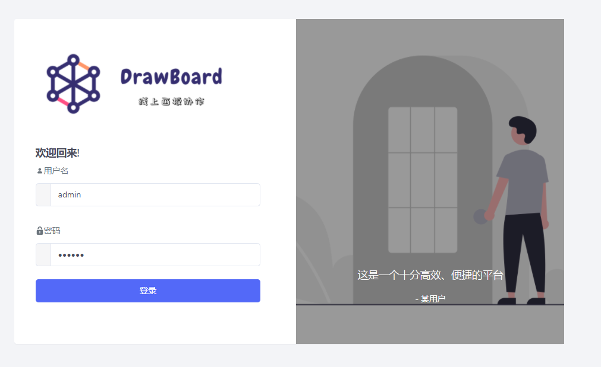

# 线上协作画板平台

本项目基于fabric.js绘制画板，使用了netty-socketio进行通信，采用springboot+vue的前后端分离模式。并在此基础上搭建了用户管理平台，使用Shiro方式实现了按钮级别的权限控制。

### 一、功能清单

#### 一览表

| 功能     | 描述                                                         |
| -------- | ------------------------------------------------------------ |
| 用户管理 | 包括用户注册、登录系统及管理员对用户的控制                   |
| 权限管理 | 给用户分配不同角色，对应了系统每个功能的不同操作权限         |
| 画布编辑 | 包括了画布的增加、删除、修改、数据库读取。通过链接可分享给平台用户共同编辑或观看 |
| 画布浏览 | 记录用户浏览的平台画布，可进行删除、重新进入等操作           |
| 画布管理 | 管理员可对系统所有用户的画布进行操作                         |

#### 界面概览

###### 用户登录

###### 画布编辑

编辑者拥有多页画布，可自由编辑，也可进行文字及几何图形编辑。借助fabric的特性，可对图像进行放缩等（具体参考fabric文档）

###### 画布记录

###### 用户管理

###### 权限管理

### 二、安装

#### 前端项目

| name     | content         |
| -------- | --------------- |
| 项目名   | frontend        |
| 开发工具 | VS Code         |
| 开发环境 | Node.js、Vue.js |

#### 后端项目

| name     | content           |
| -------- | ----------------- |
| 项目名   | backend           |
| 开发工具 | IDEA 2018以上版本 |
| 开发环境 | Jdk 8、MySql 8.0+ |

### 三、运行

1. 数据库连接添加用户root，密码1234，新建数据库drawboard，导入drawboard.sql文件。
2. VS Code打开项目frontend，控制台运行npm install 和 npm run dev
3. npm安装失败可尝试yarn install及yarn start
4. IDEA打开项目backend，运行Application
5. 浏览器输入http://localhost:9520/ 打开网页

### 四、参考资料

项目开发过程中参考了很多优秀项目的设计，如下：

#### **画板**

https://github.com/kxsq123/drawing-board 

#### **框架**

https://github.com/Heeexy/SpringBoot-Shiro-Vue

https://github.com/lihengming/spring-boot-api-project-seed

#### **通信**

https://github.com/mrniko/netty-socketio-demo 